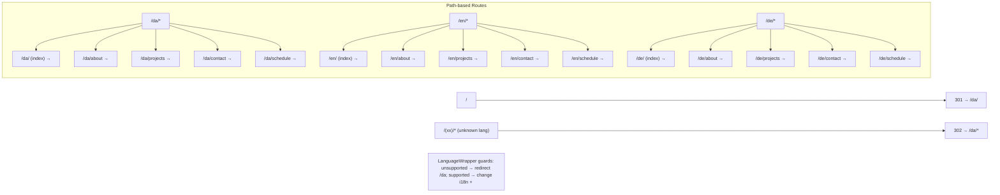
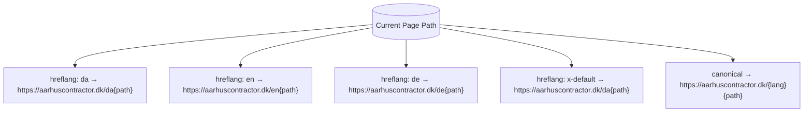
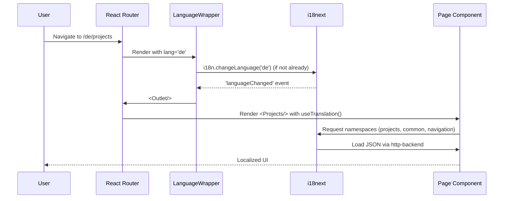

# Aarhus Contractor – i18n Architecture Diagrams

## 1) Folder Structure (Mermaid)

```mermaid
flowchart TD
    A[src/]:::dir
    A --> A1[i18n/]:::dir
    A --> A2[locales/]:::dir
    A --> A3[layout/]:::dir
    A --> A4[pages/]:::dir

    A1 --> A1a[i18n.js]
    A1 --> A1b[LanguageWrapper.jsx]
    A1 --> A1c[helpers.js]

    A2 --> EN[en/]:::dir
    A2 --> DA[da/]:::dir
    A2 --> DE[de/]:::dir

    EN --> EN1[common.json]
    EN --> EN2[navigation.json]
    EN --> EN3[home.json]
    EN --> EN4[about.json]
    EN --> EN5[projects.json]
    EN --> EN6[contact.json]
    EN --> EN7[schedule.json]
    EN --> EN8[errors.json]

    DA --> DA1[common.json]
    DA --> DA2[navigation.json]
    DA --> DA3[home.json]
    DA --> DA4[about.json]
    DA --> DA5[projects.json]
    DA --> DA6[contact.json]
    DA --> DA7[schedule.json]
    DA --> DA8[errors.json]

    DE --> DE1[common.json]
    DE --> DE2[navigation.json]
    DE --> DE3[home.json]
    DE --> DE4[about.json]
    DE --> DE5[projects.json]
    DE --> DE6[contact.json]
    DE --> DE7[schedule.json]
    DE --> DE8[errors.json]

    A3 --> L1[Header.tsx]
    A3 --> L2[Footer.tsx]

    A4 --> P1[Home/]
    A4 --> P2[About/]
    A4 --> P3[Projects/]
    A4 --> P4[Contact/]
    A4 --> P5[Schedule/]

classDef dir fill:#f5f5f5,stroke:#ccc,stroke-width:1px,color:#333;
```


---

## 2) Route Topology (Mermaid)


---

## 3) SEO Links Per Page (Mermaid)


---

## 4) i18n Lifecycle (Mermaid Sequence)


---

## 5) Language Switcher Path Logic (Mermaid)
```mermaid
flowchart TD
    A[Current pathname: /en/projects] --> B[strip prefix: projects]
    B --> C[choose new lang: 'da']
    C --> D[build: /da/projects]
    D --> E[navigate() to /da/projects]
    E --> F[LanguageWrapper sets i18n → 'da' and renders]
```

---

**Tip:** If you want these to render on GitHub, ensure Mermaid is enabled (it is by default). For static sites, you can also embed Mermaid runtime to render client-side.
